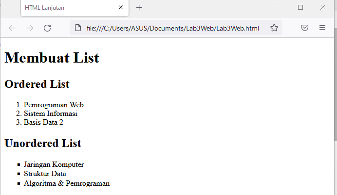
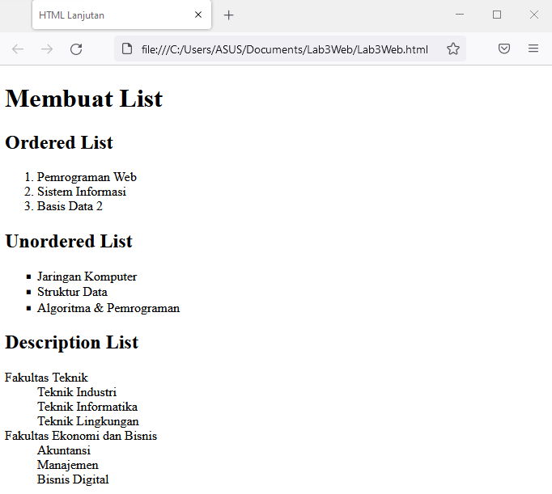
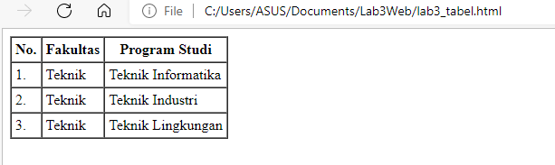
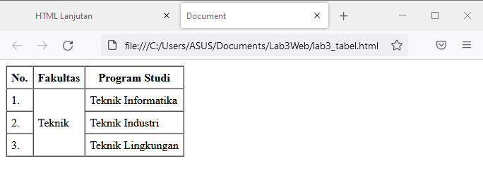

# Lab3Web
**Tugas Pertemuan 4**

| Nama | Moch. Nauval Faris Muzaki |
| --- | --- |
| NIM | 312010122 |
| Kelas | TI.20.B1
| Mata Kuliah | Pemrograman Web |

1. **Membuat Ordered List**

Untuk mebuat ordered list kita menggunakan misal angka atau huruf dan lainnnya, Berikut contohnya.

2. **Membuat Unorderd List**

Untuk mebuat Unodered list kita menggunakan misal titik kotak atau bulat kecil dan lainnnya, Berikut contohnya.

3. **Membuat Description List**

Kemudian membuat deklarasi list tanpa tanda didepannya, berikut contohnya

4. **Membuat Tabel**

Berikut adalah contoh membuat list di dalam tabel, berikut gambarnya

5. **Menggabungkan Sel Data**

Untuk menggabungkan sel data, gunakan atribut rowspan dan colspan. Atribut rowspan untuk 
menggabungkan baris (secara vertikal) dan colspan untuk menggabungkan kolom, secara 
horizontal. Berikut gambarnya

