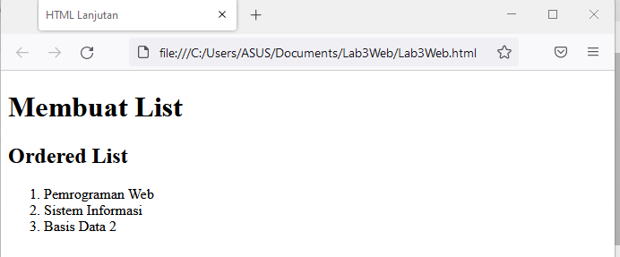

# Lab3Web
**Tugas Pertemuan 4**

| Nama | Moch. Nauval Faris Muzaki |
| --- | --- |
| NIM | 312010122 |
| Kelas | TI.20.B1
| Mata Kuliah | Pemrograman Web |

1. **Membuat Ordered List**

Untuk mebuat ordered list kita menggunakan syntax ini, Berikut contohnya.

